


### Software Engineer · GenAI & Data · Applied ML

**Foot Locker intern** &nbsp; / &nbsp; **MS CS @ UNT** &nbsp; / &nbsp; **Previously TCS**

*I turn messy data into useful systems and coffee into suspiciously specific commits.*

## 🌃 My commits grew buildings

*An actual contribution skyline. The zoning committee is just me and a keyboard.*

<a href="https://github.com/PCTEJA?tab=overview">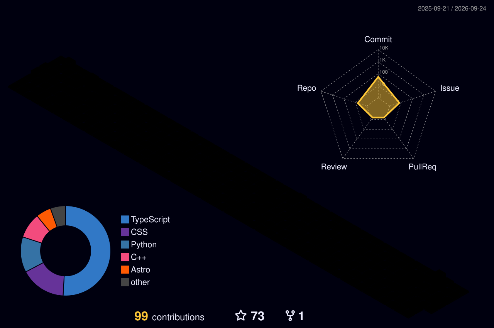</a>

☀️ Switch on the lights — another view of the same contributions

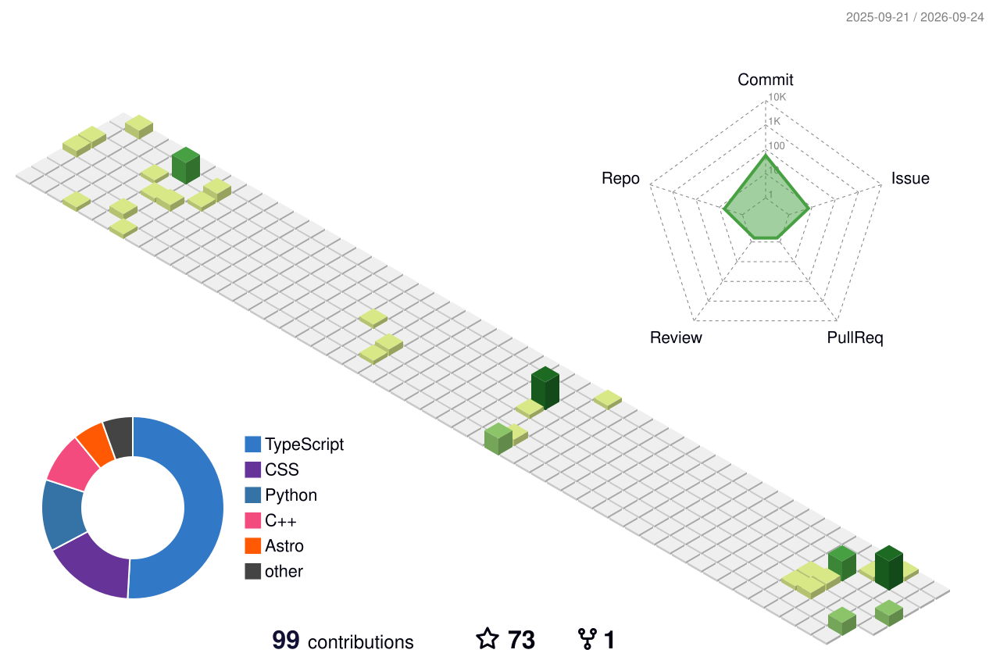

## 📡 The GitHub telemetry


 

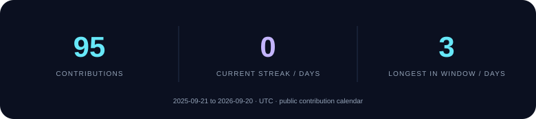

 


Refreshed daily from public GitHub data. Streaks use UTC and the displayed calendar window; language share reflects repository code, not proficiency.

### 🐍 The contribution grid has a tiny pest problem

*It eats contribution squares. I eat merge conflicts. A balanced ecosystem.*

## 🧑‍🚀 The human behind the keyboard

I’m **Teja P C**. I build across **full-stack software, production GenAI, and data engineering**. My favorite projects make something complicated feel simple—whether that’s document extraction, developer education, or a checkout that makes fewer unnecessary API calls.

- 🛍️ **Now:** software engineering at **Foot Locker** and an **MS in Computer Science at UNT** (expected 2027).
- 🧠 **Previously:** **3+ years at TCS**, building data pipelines and LLM-powered document workflows.
- ☀️ **Research side quest:** machine learning for solar-power forecasting.
- 🧑‍🏫 **Teaching side quest:** helped **180+ students** learn Python, ML, and AI at UNT.

> My favorite kind of AI magic comes with input validation, useful logs, and a rollback plan.

## 🛠️ The workshop

<a href="https://github.com/PCTEJA/intro_to_mcp">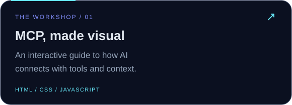</a>
<a href="https://github.com/PCTEJA/MCP-Prediction-Machine-Learning-Project">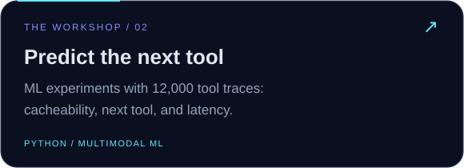</a>
 
<a href="https://github.com/PCTEJA/tejapc_3d_portfolio">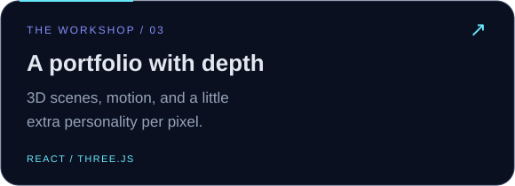</a>
<a href="https://github.com/PCTEJA/SOLAR-POWER-PREDICTOR">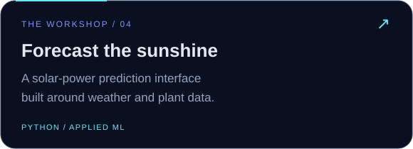</a>

**Try it live:** [MCP Learning Platform](https://intro-to-mcp.vercel.app/) · [3D Portfolio](https://teja3d.netlify.app/)

*My portfolio has an extra dimension. My TODO list did not need one.*

## ⚙️ The toolbox

 

**AI:** OpenAI & Gemini APIs · OCR · structured outputs · prompt engineering 
**Data:** SQL · ETL/ELT · Talend · data validation · event-driven pipelines

## ⚡ A few things that shipped

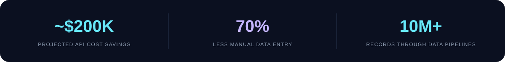

<b>The receipts: experience, education & research</b>

### Engineering

- **Foot Locker · Software Engineering Intern (Jun 2026–present):** full-stack checkout experiences, API development, regression automation, and nearly **$200K in projected API savings** from removing redundant address-validation calls.
- **TCS · Cotality (2024–2025):** OCR + Gemini extraction pipelines cut manual data entry by **70%**. FastAPI services on Cloud Run reduced model-serving latency by **40%**.
- **TCS · NOW: Pensions (2022–2024):** Python/SQL pipelines processed **10M+ records**; Talend migrations moved millions with **zero data loss**. CI/CD improvements shortened release cycles by **30%**.
- **UNT · Graduate Teaching Assistant (Oct 2025–May 2026):** teaching and mentorship for **180+ students** in Python, ML, and AI.

### Education & recognition

- **MS Computer Science, University of North Texas** — expected June 2027; GPA **4.0/4.0**.
- **B.Tech CSE, BIHER** — 2022; GPA **9.33/10.0**.
- **TCS Best Team Member:** 2022 & 2024.
- **1st place, Energy Track project competition:** Ural Federal University.
- **Oracle Cloud Infrastructure 2023 Certified Application Integration Professional**.

### Selected research

- [The Industrial Methods to Improve the Day-Ahead Solar Forecasting](https://doi.org/10.3390/rs12203420)
- [Prediction of Solar Power Generation Based on Random Forest Regressor Model](https://doi.org/10.1109/SIBIRCON48586.2019.8958063)
- [Strategic Planning of Renewable Energy Implementation](https://doi.org/10.1109/ICSTCEE49637.2020.9277484)

[More on Google Scholar →](https://scholar.google.com/citations?user=mZGqviAAAAAJ&hl=en)

## ☕ Keep the human runtime running

If something here helped you learn, build, or survive a debugging session:

**Coffee → curiosity → code → “one tiny fix” → another commit.**

A star, a thoughtful issue, or a kind message is excellent fuel too. 💛

[Email](mailto:pcteja2000@gmail.com) · [LinkedIn](https://www.linkedin.com/in/tejapc/) · [LeetCode](https://leetcode.com/pc2827/) · [CodeChef](https://www.codechef.com/users/pcteja)

---

*May your tests pass and your “quick fix” actually be quick.*

Visual inspiration: [Sindre Sorhus](https://github.com/sindresorhus/sindresorhus) & [Abhishek Naidu](https://github.com/abhisheknaiidu/abhisheknaiidu). Built with [3D Contrib](https://github.com/yoshi389111/github-profile-3d-contrib), [snk](https://github.com/Platane/snk), [GitHub Readme Stats](https://github.com/stats-organization/github-readme-stats-action), and [Skill Icons](https://github.com/tandpfun/skill-icons).

